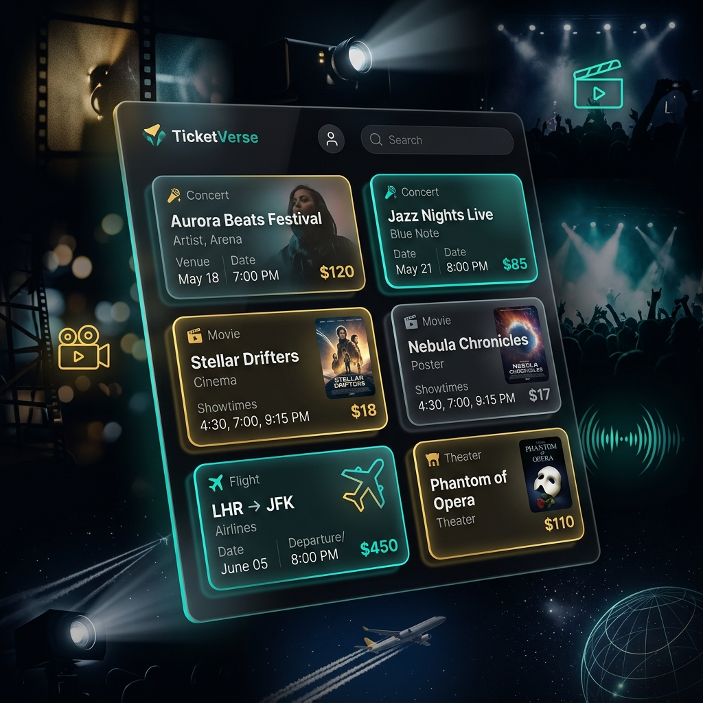
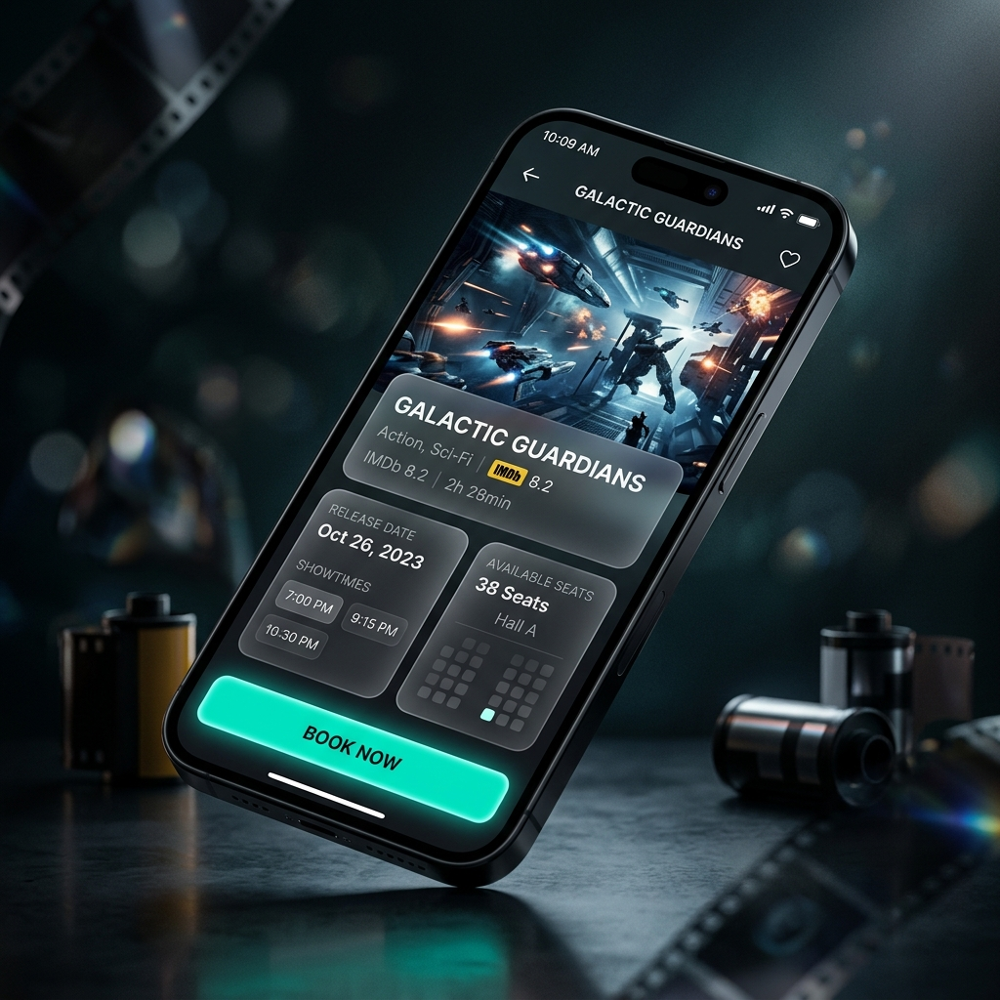
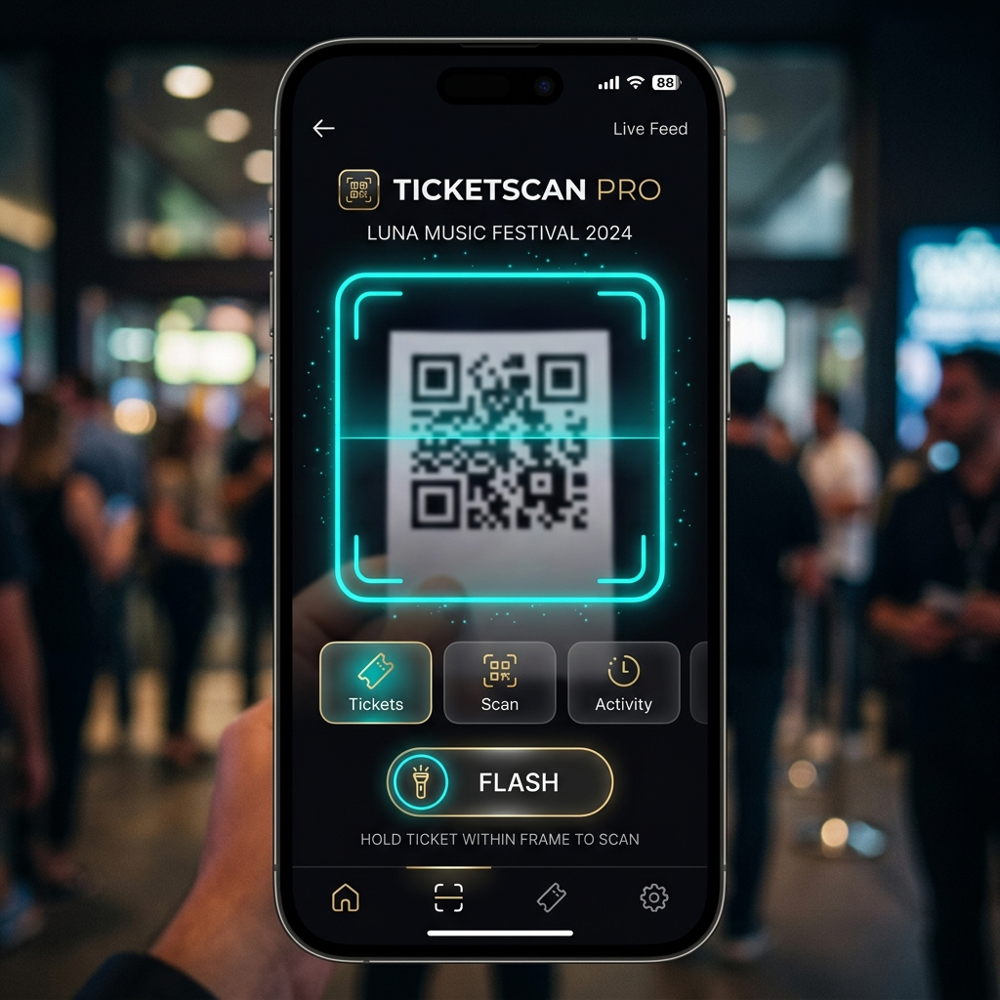

<div align="center">
  
  <h1>TicketVerse</h1>
  <p><strong>A Premium Full-Stack Mobile Booking Experience</strong></p>
</div>

---

## 🎬 About TicketVerse

TicketVerse is a state-of-the-art mobile application designed to completely modernize the way you discover and book tickets for Movies, Events, and Travel. 

Built using a powerful **React Native / Expo** frontend and a blazingly fast **Node.js + Express + MySQL** backend, TicketVerse boasts a 100% dark mode, ultra-premium glassmorphism design.

## 📸 Premium Interface Showcases

<div align="center">
  
  <p><em>The intuitive, glowing 2-column discovery grid.</em></p>
</div>

<br/>

<div align="center">
  
  <p><em>The cinematic details screen featuring parallax scrolling and glassmorphism cards.</em></p>
</div>

## 📸 Advanced Scanning Technology

TicketVerse isn't just about booking; it's about a seamless entry and professional management experience.

<div align="center">
  
  
  <p><em>Left: Professional QR Ticket Scanner. Right: Premium Card/ID Scanner.</em></p>
</div>

*   **Real-time Ticket Verification:** Blazingly fast QR code scanning with neon-teal guidance overlays and haptic feedback.
*   **Professional Card Recognition:** Dedicated scanner for ID cards and professional badges with gold-accented precision frames.
*   **Intuitive Feedback Loop:** Immediate visual confirmation and success animations upon successful scan.

## ✨ Key Technical Features

*   **Cinematic "Stitch & Skills" UI:** Highly polished user interface with custom animations, blurred glassmorphism cards, and a sophisticated color palette (`#0a0a0f` deep darks with neon teal and gold accents).
*   **Parallax & Gesture Animations:** Smooth, 60fps native animations using `Animated.ScrollView` and `useNativeDriver`.
*   **Interactive Success Modals:** Satisfying visual feedback loop when completing a booking.
*   **Zero-Duplicate Architecture:** Optimized SQL queries (`MIN(id)` grouping) ensures the grid remains perfectly clean.
*   **Cross-Platform Ready:** Native-bridge stabilized configurations (`expo-status-bar`, `react-native-safe-area-context`) for flawless Android and iOS compilation.

## 🚀 Getting Started

### 1. The Backend (Server)
```bash
cd server
npm install
npm start
```
*Ensure you have MySQL running with the database populated via `database/schema.sql` and `database/seed.sql`.*

### 2. The Mobile App (Expo)
```bash
cd mobile
npm install
npx expo start
```
*Use the Expo Go app on your phone to scan the QR code and experience the app, or download the compiled `.apk` release!*

---
<div align="center">
  <p>Built with ❤️ using React Native, Expo, Node.js & MySQL</p>
</div>
